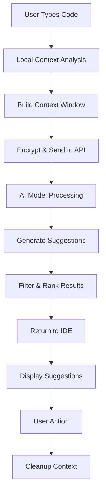

// ...existing code...

## 🔒 **GitHub Copilot Data Handling & Architecture Deep Dive**

### **Training Data & Organizational Privacy**

#### **❌ What Copilot is NOT trained on:**
- **Your private organizational code** (unless explicitly opted-in via Enterprise)
- **Real-time user inputs** during coding sessions
- **Proprietary business logic** from private repositories
- **Sensitive data** from your local development environment

#### **✅ What Copilot IS trained on:**
- **Public repositories** on GitHub (pre-2021 training cutoff)
- **Open source projects** with permissive licenses
- **Public documentation** and code examples
- **Stack Overflow** and other public coding resources

```yaml
# Training Data Sources (Base Model)
public_repositories: ~159 million repos
languages_covered: 80+ programming languages
training_cutoff: September 2021 (base model)
data_filtering: 
  - Removed personal data
  - Excluded secrets/tokens
  - Filtered low-quality code
```

---

### **🏢 Enterprise vs Individual Data Handling**

#### **GitHub Copilot Individual/Business:**
```yaml
Data Processing:
  training_on_user_code: false
  context_retention: session-only
  telemetry_data: usage patterns only
  code_storage: temporary processing only
  
Privacy Guarantees:
  - Code never used for model training
  - No persistent storage of user code
  - Encrypted transmission (TLS 1.3)
  - Zero data retention post-session
```

#### **GitHub Copilot Enterprise (Optional Training):**
```yaml
Custom Training Options:
  organization_specific_training: optional
  private_repo_access: admin-controlled
  custom_model_fine_tuning: available
  knowledge_base_integration: organization-wide
  
Enterprise Controls:
  - Admin can enable/disable org training
  - Granular repository inclusion/exclusion
  - Custom model deployment options
  - On-premises deployment available
```

---

### **🧠 Context Handling & Memory Architecture**

#### **Context Window Management:**
```python
# Copilot's context processing pipeline
class CopilotContext:
    def __init__(self):
        self.max_context_length = 8192  # tokens (varies by model)
        self.context_types = {
            'current_file': 0.4,      # 40% of context
            'open_files': 0.3,        # 30% of context  
            'recent_changes': 0.2,    # 20% of context
            'conversation_history': 0.1  # 10% of context
        }
    
    def build_context(self, current_session):
        context = {
            # Current file context
            'active_file': self.get_file_content_with_cursor(),
            'file_structure': self.get_project_structure(),
            
            # Multi-file context (Enterprise)
            'related_files': self.find_related_files(),
            'import_dependencies': self.analyze_imports(),
            
            # Session context
            'recent_edits': self.get_recent_changes(minutes=30),
            'chat_history': self.get_conversation_context(),
            
            # Metadata
            'language': self.detect_language(),
            'framework': self.detect_framework(),
            'coding_style': self.analyze_patterns()
        }
        return self.optimize_context_size(context)
```

#### **Smart Context Prioritization:**
```yaml
Context Priority Algorithm:
  1. Current cursor position: Highest priority
  2. Currently selected code: High priority
  3. Recently modified lines: Medium-high priority
  4. Function/class containing cursor: Medium priority
  5. Import statements: Medium priority
  6. Related files (same package): Low-medium priority
  7. Chat conversation history: Low priority
  8. Project-wide patterns: Lowest priority

Dynamic Adjustment:
  - Increase context for complex operations
  - Reduce context for simple completions
  - Prioritize relevant files over distant ones
  - Weight recent interactions higher
```

---

### **💾 Memory Layers & Session Management**

#### **Session-Level Memory (Temporary):**
```typescript
interface CopilotSession {
  sessionId: string;
  startTime: Date;
  contextMemory: {
    // File-level memory
    openFiles: Map<string, FileContext>;
    recentEdits: EditHistory[];
    
    // Conversation memory  
    chatHistory: ChatMessage[];
    userPreferences: UserPreferences;
    
    // Project memory
    codebaseStructure: ProjectStructure;
    detectedPatterns: CodingPattern[];
  };
  
  // Memory cleanup
  cleanup(): void {
    // All session data is purged when session ends
    this.contextMemory = null;
    // No persistent storage of user code
  }
}
```

#### **Cross-Session Learning (Pattern Recognition):**
```python
# How Copilot "remembers" without storing your code
class PatternRecognition:
    def extract_anonymous_patterns(self, code_context):
        patterns = {
            'coding_style': {
                'indentation': self.detect_indentation(),
                'naming_convention': self.detect_naming(),
                'comment_style': self.detect_comments(),
                'import_patterns': self.detect_imports()
            },
            'architectural_patterns': {
                'design_patterns': self.identify_patterns(),
                'framework_usage': self.detect_framework_patterns(),
                'error_handling': self.analyze_error_patterns()
            }
        }
        
        # Convert to anonymous, statistical representations
        return self.anonymize_patterns(patterns)
```

---

### **🔄 Real-Time Processing Architecture**

#### **Request Processing Pipeline:**


#### **Context Building Algorithm:**
```python
def build_optimal_context(current_state):
    context_budget = 8192  # token limit
    
    # Priority-based context allocation
    context_parts = []
    
    # 1. Essential context (always included)
    essential = {
        'cursor_position': get_cursor_context(radius=50),
        'current_function': get_enclosing_function(),
        'imports': get_file_imports()
    }
    context_parts.append(essential)
    
    # 2. Adaptive context (based on task type)
    if is_debugging():
        context_parts.append(get_error_context())
        context_parts.append(get_stack_trace())
    elif is_writing_tests():
        context_parts.append(get_function_signatures())
        context_parts.append(get_existing_tests())
    elif is_refactoring():
        context_parts.append(get_class_hierarchy())
        context_parts.append(get_usage_patterns())
    
    # 3. Fill remaining budget with relevant files
    remaining_budget = context_budget - calculate_tokens(context_parts)
    if remaining_budget > 0:
        related_files = find_related_files(current_file)
        context_parts.append(
            select_files_by_relevance(related_files, remaining_budget)
        )
    
    return optimize_context(context_parts)
```

---

### **🛡️ Privacy & Security Mechanisms**

#### **Data Protection Layers:**
```yaml
Transport Security:
  encryption: TLS 1.3
  certificate_pinning: enabled
  request_signing: HMAC-SHA256
  
Processing Security:
  code_encryption: AES-256 at rest
  memory_isolation: sandboxed processing
  access_logging: comprehensive audit trail
  
Privacy Controls:
  content_filtering: remove_secrets()
  data_minimization: only_necessary_context()
  retention_policy: zero_persistent_storage()
  geographic_controls: region_specific_processing()
```

#### **Enterprise Security Features:**
```python
class EnterpriseSecurityControls:
    def __init__(self, org_config):
        self.ip_allowlisting = org_config.allowed_ips
        self.content_policies = org_config.content_filters
        self.audit_logging = org_config.audit_settings
        
    def process_request(self, request):
        # 1. IP validation
        if not self.validate_ip(request.source_ip):
            raise SecurityException("IP not allowed")
        
        # 2. Content filtering
        if self.contains_sensitive_data(request.content):
            return self.apply_content_policy(request.content)
        
        # 3. Audit logging
        self.log_request(request, self.get_user_context())
        
        # 4. Process with organization-specific model
        return self.process_with_custom_model(request)
```

---

### **🔍 How Copilot Handles Specific Tasks**

#### **Code Completion Without Training on Your Code:**
```python
# Example: How Copilot suggests code without seeing your specific implementation
class TaskHandler:
    def generate_suggestion(self, context):
        # 1. Analyze patterns in context
        patterns = self.extract_patterns(context)
        
        # 2. Match against learned patterns from public code
        similar_patterns = self.find_similar_public_patterns(patterns)
        
        # 3. Generate suggestion based on:
        #    - Current context (your code structure)
        #    - Public code patterns (training data)
        #    - Programming best practices
        suggestion = self.synthesize_suggestion(
            context_patterns=patterns,
            public_patterns=similar_patterns,
            best_practices=self.get_best_practices()
        )
        
        return suggestion
```

#### **Chat Memory Management:**
```typescript
class ChatMemoryManager {
    private conversationContext: ChatMessage[] = [];
    private maxContextLength = 4096; // tokens
    
    addMessage(message: ChatMessage): void {
        this.conversationContext.push(message);
        this.pruneContext();
    }
    
    private pruneContext(): void {
        // Keep recent messages and important context
        let totalTokens = 0;
        const importantMessages = [];
        
        // Always keep system message and recent messages
        for (let i = this.conversationContext.length - 1; i >= 0; i--) {
            const msg = this.conversationContext[i];
            const tokens = this.estimateTokens(msg);
            
            if (totalTokens + tokens < this.maxContextLength) {
                importantMessages.unshift(msg);
                totalTokens += tokens;
            } else {
                break;
            }
        }
        
        this.conversationContext = importantMessages;
    }
    
    clearSession(): void {
        // Complete memory cleanup on session end
        this.conversationContext = [];
        // No persistent storage - everything is forgotten
    }
}
```

---

### **📊 Context Optimization Strategies**

#### **Intelligent File Selection:**
```python
def select_relevant_files(current_file, max_context_tokens):
    relevance_scores = {}
    
    # Calculate relevance based on multiple factors
    for file in project_files:
        score = 0
        
        # Import relationships
        if file in get_imports(current_file):
            score += 10
        if current_file in get_imports(file):
            score += 8
            
        # Structural similarity
        if same_package(file, current_file):
            score += 5
        if similar_class_names(file, current_file):
            score += 3
            
        # Recent edit proximity
        if recently_edited(file, minutes=10):
            score += 4
        if open_in_editor(file):
            score += 6
            
        # Semantic similarity (based on function names, comments)
        semantic_score = calculate_semantic_similarity(file, current_file)
        score += semantic_score
        
        relevance_scores[file] = score
    
    # Select files that fit within context budget
    selected_files = []
    remaining_tokens = max_context_tokens
    
    for file in sorted(relevance_scores.items(), key=lambda x: x[1], reverse=True):
        file_tokens = estimate_file_tokens(file[0])
        if file_tokens <= remaining_tokens:
            selected_files.append(file[0])
            remaining_tokens -= file_tokens
        
        if remaining_tokens < 100:  # Reserve space for other context
            break
    
    return selected_files
```

---

### **🔐 Enterprise Data Isolation**

#### **Organization-Specific Processing:**
```yaml
Enterprise Isolation Levels:

Level 1 - Basic Isolation:
  - Separate processing queues
  - Organization-specific rate limits
  - Basic audit logging
  
Level 2 - Enhanced Isolation:
  - Dedicated model instances
  - Custom fine-tuning on org data
  - Advanced security controls
  
Level 3 - Complete Isolation:
  - On-premises deployment
  - Air-gapped processing
  - Custom model training pipeline
  - Full data sovereignty
```

#### **Custom Model Training (Enterprise):**
```python
class OrganizationSpecificTraining:
    def __init__(self, org_id, base_model):
        self.org_id = org_id
        self.base_model = base_model
        self.custom_patterns = {}
        
    def train_on_organization_code(self, repo_data):
        # Only with explicit admin consent
        if not self.has_training_consent():
            raise PermissionError("Organization training not enabled")
        
        # Extract patterns without storing raw code
        patterns = self.extract_anonymous_patterns(repo_data)
        
        # Fine-tune model on organization-specific patterns
        self.custom_model = self.fine_tune_model(
            base_model=self.base_model,
            patterns=patterns,
            organization_style=self.detect_coding_style(repo_data)
        )
        
        # Store only the model weights, not the training data
        self.save_custom_model(self.custom_model)
        
    def generate_suggestion(self, context):
        # Use organization-specific model if available
        if hasattr(self, 'custom_model'):
            return self.custom_model.generate(context)
        else:
            return self.base_model.generate(context)
```

---

## **Key Takeaways:**

1. **🔒 Privacy-First Design:** Your code is never stored or used for training (unless explicitly opted-in via Enterprise)

2. **🧠 Smart Context Management:** Uses sophisticated algorithms to build optimal context without compromising privacy

3. **⚡ Session-Only Memory:** All context is temporary and cleaned up after each session

4. **🏢 Enterprise Flexibility:** Organizations can choose their level of data sharing and model customization

5. **🛡️ Multiple Security Layers:** Comprehensive protection from transport to processing to cleanup

6. **🎯 Task-Specific Optimization:** Context and processing adapt based on what you're trying to accomplish

The system is designed to be helpful and intelligent while maintaining strict privacy boundaries and giving organizations full control over their data handling preferences.

// ...existing code...