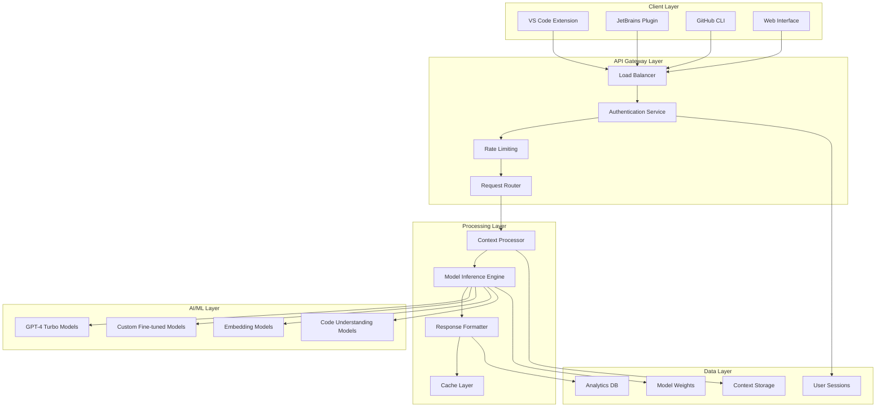
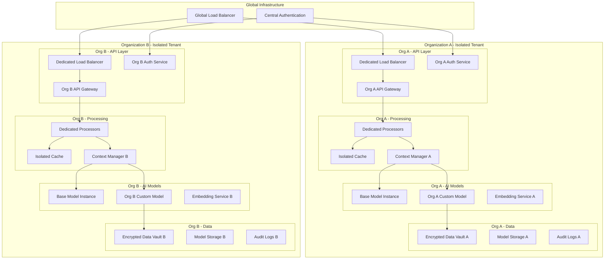
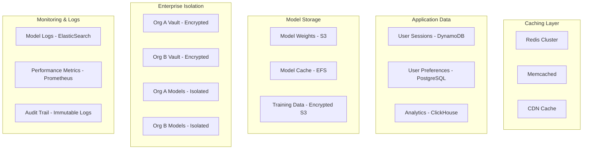
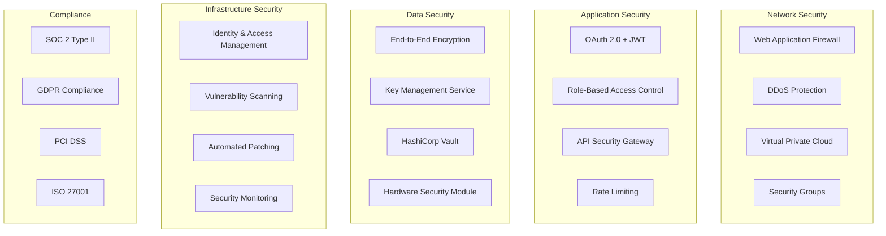

## 🏗️ **GitHub Copilot Technical Architecture Deep Dive**

### **🌐 High-Level System Architecture**



---

### **🏢 Enterprise Multi-Tenant Architecture**



---

### **🔧 Detailed Component Architecture**

#### **1. Client-Side Architecture**

```typescript
// VS Code Extension Architecture
interface CopilotClientArchitecture {
  components: {
    // Language Server Protocol integration
    languageServer: {
      protocol: "LSP 3.17",
      capabilities: [
        "textDocument/completion",
        "textDocument/inlineCompletion", 
        "textDocument/codeAction",
        "workspace/executeCommand"
      ],
      communication: "JSON-RPC over WebSocket"
    },
    
    // Context collection
    contextCollector: {
      fileWatcher: "VSCode FileSystemWatcher",
      documentManager: "TextDocumentManager",
      selectionTracker: "SelectionChangeTracker",
      gitIntegration: "Git Extension API"
    },
    
    // UI Components
    userInterface: {
      inlineCompletions: "CompletionProvider",
      chatInterface: "WebView Panel",
      statusIndicator: "StatusBarItem",
      settingsPanel: "ConfigurationProvider"
    },
    
    // Communication layer
    apiClient: {
      transport: "HTTPS/WebSocket",
      authentication: "OAuth 2.0 + JWT",
      encryption: "TLS 1.3",
      compression: "gzip"
    }
  }
}
```

#### **2. API Gateway & Load Balancing**

```python
class CopilotAPIGateway:
    def __init__(self):
        self.architecture = {
            'load_balancer': {
                'type': 'Application Load Balancer (ALB)',
                'distribution': 'round_robin_with_sticky_sessions',
                'health_checks': 'continuous_monitoring',
                'failover': 'automatic_with_circuit_breaker'
            },
            
            'api_gateway': {
                'framework': 'Kong/Nginx',
                'rate_limiting': {
                    'individual_users': '1000_requests_per_minute',
                    'enterprise_orgs': 'unlimited_with_fair_use',
                    'burst_handling': 'token_bucket_algorithm'
                },
                'authentication': {
                    'method': 'JWT_with_refresh_tokens',
                    'validation': 'RSA_256_signature',
                    'session_management': 'stateless_design'
                }
            },
            
            'request_routing': {
                'strategy': 'organization_based_routing',
                'enterprise_isolation': 'dedicated_endpoints',
                'caching': 'redis_cluster_per_tenant'
            }
        }
```

#### **3. Context Processing Engine**

```python
class ContextProcessingArchitecture:
    def __init__(self):
        self.pipeline = {
            'input_processing': {
                'sanitization': 'remove_sensitive_data',
                'tokenization': 'tiktoken_encoder',
                'language_detection': 'tree_sitter_parsers',
                'structure_analysis': 'ast_extraction'
            },
            
            'context_building': {
                'file_analysis': {
                    'current_file': 'full_content_with_cursor_position',
                    'related_files': 'import_dependency_graph',
                    'project_structure': 'file_hierarchy_analysis'
                },
                'semantic_analysis': {
                    'function_signatures': 'ast_based_extraction',
                    'class_hierarchies': 'inheritance_mapping',
                    'variable_scoping': 'scope_resolution'
                },
                'contextual_ranking': {
                    'relevance_scoring': 'tf_idf_with_code_similarity',
                    'recency_weighting': 'time_decay_function',
                    'user_behavior': 'interaction_pattern_analysis'
                }
            },
            
            'optimization': {
                'token_management': 'dynamic_context_pruning',
                'caching': 'semantic_hash_based_caching',
                'compression': 'context_summarization'
            }
        }
```

---

### **🤖 AI/ML Model Architecture**

#### **Model Infrastructure**

```yaml
AI_Model_Architecture:
  
  Base_Models:
    primary_model:
      name: "GPT-4 Turbo"
      parameters: "~175B"
      context_window: "128k tokens"
      deployment: "distributed_inference"
      
    specialized_models:
      code_completion:
        name: "Codex-derived"
        optimization: "code_specific_fine_tuning"
        languages: "80+ programming languages"
        
      chat_model:
        name: "GPT-4 Chat"
        capabilities: "conversational_code_assistance"
        context_retention: "multi_turn_conversations"
        
      embedding_model:
        name: "text-embedding-ada-002"
        purpose: "semantic_code_search"
        dimensions: "1536"

  Model_Serving:
    infrastructure:
      orchestration: "Kubernetes with GPU nodes"
      scaling: "horizontal_pod_autoscaling"
      gpu_type: "NVIDIA A100/H100"
      model_parallelism: "tensor_parallel_across_gpus"
      
    inference_optimization:
      batching: "dynamic_batching_with_padding"
      caching: "kv_cache_optimization"
      quantization: "int8_inference"
      compilation: "torch_compile_optimization"

  Custom_Models_Enterprise:
    training_pipeline:
      base_model: "organization_specific_fine_tuning"
      training_data: "private_repository_analysis"
      training_method: "parameter_efficient_fine_tuning"
      storage: "encrypted_model_registry"
```

#### **Model Inference Pipeline**

```python
class ModelInferencePipeline:
    def __init__(self, organization_id=None):
        self.organization_id = organization_id
        self.model_selector = ModelSelector()
        self.inference_engine = InferenceEngine()
        
    def process_request(self, context, task_type):
        # 1. Model Selection
        model_config = self.select_optimal_model(context, task_type)
        
        # 2. Request Preprocessing
        processed_input = self.preprocess_context(context)
        
        # 3. Inference Execution
        inference_result = self.execute_inference(
            model=model_config.model,
            input=processed_input,
            parameters=model_config.parameters
        )
        
        # 4. Post-processing
        formatted_response = self.postprocess_response(
            inference_result,
            task_type,
            context.output_format
        )
        
        return formatted_response
    
    def select_optimal_model(self, context, task_type):
        """Select best model based on task and organization"""
        if self.organization_id and self.has_custom_model():
            return self.get_custom_model_config()
        
        model_configs = {
            'code_completion': {
                'model': 'gpt-4-turbo-code',
                'temperature': 0.1,
                'max_tokens': 500,
                'top_p': 0.95
            },
            'code_explanation': {
                'model': 'gpt-4-turbo',
                'temperature': 0.3,
                'max_tokens': 1000,
                'top_p': 0.9
            },
            'chat_conversation': {
                'model': 'gpt-4-turbo-chat',
                'temperature': 0.7,
                'max_tokens': 2000,
                'top_p': 0.9
            }
        }
        
        return model_configs.get(task_type, model_configs['code_completion'])
```

---

### **💾 Data Architecture & Storage**

#### **Data Layer Design**



#### **Storage Implementation**

```python
class CopilotDataArchitecture:
    def __init__(self):
        self.storage_config = {
            'session_storage': {
                'technology': 'Redis Cluster',
                'replication': '3x replicas',
                'persistence': 'RDB + AOF',
                'encryption': 'AES-256 in transit and at rest',
                'ttl': '24 hours max session lifetime'
            },
            
            'model_storage': {
                'base_models': {
                    'storage': 'Amazon S3',
                    'redundancy': 'cross_region_replication',
                    'access': 'versioned_with_immutable_references'
                },
                'custom_models': {
                    'storage': 'organization_specific_s3_buckets',
                    'encryption': 'customer_managed_keys',
                    'isolation': 'complete_tenant_separation'
                }
            },
            
            'analytics_storage': {
                'technology': 'ClickHouse Cluster',
                'partitioning': 'by_organization_and_date',
                'retention': 'configurable_per_organization',
                'compression': 'lz4_algorithm'
            },
            
            'audit_storage': {
                'technology': 'immutable_append_only_logs',
                'compliance': 'sox_pci_gdpr_compliant',
                'retention': 'minimum_7_years',
                'integrity': 'cryptographic_hash_chains'
            }
        }
```

---

### **🔐 Security Architecture**

#### **Security Layers**



#### **Security Implementation**

```python
class SecurityArchitecture:
    def __init__(self):
        self.security_layers = {
            'transport_security': {
                'tls_version': 'TLS 1.3',
                'cipher_suites': 'AEAD_ciphers_only',
                'certificate_pinning': 'enabled',
                'hsts': 'strict_transport_security'
            },
            
            'authentication': {
                'method': 'OAuth 2.0 with PKCE',
                'token_type': 'JWT with refresh tokens',
                'token_lifetime': 'access_15min_refresh_7days',
                'mfa_support': 'totp_and_hardware_keys'
            },
            
            'encryption': {
                'data_at_rest': 'AES-256-GCM',
                'data_in_transit': 'TLS 1.3',
                'key_management': 'HSM_backed_KMS',
                'key_rotation': 'automatic_quarterly'
            },
            
            'access_control': {
                'model': 'role_based_access_control',
                'granularity': 'resource_level_permissions',
                'enforcement': 'policy_as_code',
                'audit': 'comprehensive_access_logging'
            }
        }
```

---

### **📊 Monitoring & Observability Architecture**

#### **Observability Stack**

```yaml
Monitoring_Architecture:
  
  Metrics_Collection:
    infrastructure:
      tool: "Prometheus + Grafana"
      retention: "2 years"
      alerting: "AlertManager"
      
    application_metrics:
      - request_latency_p95
      - token_processing_rate
      - model_inference_time
      - cache_hit_ratio
      - error_rates_by_endpoint
      
    business_metrics:
      - user_satisfaction_scores
      - feature_adoption_rates
      - cost_per_request
      - revenue_attribution

  Distributed_Tracing:
    tool: "Jaeger/OpenTelemetry"
    sampling_rate: "1% for production"
    trace_retention: "30 days"
    
  Log_Management:
    aggregation: "Fluentd -> ElasticSearch"
    analysis: "Kibana dashboards"
    alerting: "log_based_alerts"
    retention: "organization_configurable"

  Real_Time_Monitoring:
    dashboard: "custom_grafana_dashboards"
    alerting: "pagerduty_integration"
    sla_monitoring: "99.9%_uptime_target"
```

---

### **🚀 Deployment & Infrastructure**

#### **Kubernetes Deployment Architecture**

```yaml
# Production Deployment Configuration
apiVersion: apps/v1
kind: Deployment
metadata:
  name: copilot-inference-service
  namespace: copilot-production
spec:
  replicas: 50
  strategy:
    type: RollingUpdate
    rollingUpdate:
      maxSurge: 25%
      maxUnavailable: 0
  selector:
    matchLabels:
      app: copilot-inference
  template:
    spec:
      # GPU-enabled nodes
      nodeSelector:
        accelerator: nvidia-tesla-a100
      
      # Resource allocation
      containers:
      - name: model-server
        image: copilot-inference:v2.4.1
        resources:
          requests:
            memory: "32Gi"
            cpu: "8"
            nvidia.com/gpu: "1"
          limits:
            memory: "64Gi"
            cpu: "16"
            nvidia.com/gpu: "2"
        
        # Environment configuration
        env:
        - name: MODEL_PARALLELISM
          value: "tensor_parallel"
        - name: BATCH_SIZE
          value: "32"
        - name: MAX_SEQUENCE_LENGTH
          value: "8192"
        
        # Health checks
        livenessProbe:
          httpGet:
            path: /health
            port: 8080
          initialDelaySeconds: 120
          periodSeconds: 30
        
        readinessProbe:
          httpGet:
            path: /ready
            port: 8080
          initialDelaySeconds: 60
          periodSeconds: 10

---
# Horizontal Pod Autoscaler
apiVersion: autoscaling/v2
kind: HorizontalPodAutoscaler
metadata:
  name: copilot-inference-hpa
spec:
  scaleTargetRef:
    apiVersion: apps/v1
    kind: Deployment
    name: copilot-inference-service
  minReplicas: 10
  maxReplicas: 200
  metrics:
  - type: Resource
    resource:
      name: cpu
      target:
        type: Utilization
        averageUtilization: 70
  - type: Pods
    pods:
      metric:
        name: requests_per_second
      target:
        type: AverageValue
        averageValue: "100"
```

#### **Multi-Region Deployment**

```python
class GlobalDeploymentArchitecture:
    def __init__(self):
        self.regions = {
            'us_east_1': {
                'primary': True,
                'capacity': '40% of global traffic',
                'services': ['api_gateway', 'inference', 'training'],
                'compliance': ['SOC2', 'PCI_DSS']
            },
            'us_west_2': {
                'primary': False,
                'capacity': '25% of global traffic',
                'services': ['api_gateway', 'inference'],
                'compliance': ['SOC2']
            },
            'eu_west_1': {
                'primary': False,
                'capacity': '25% of global traffic',
                'services': ['api_gateway', 'inference'],
                'compliance': ['GDPR', 'SOC2']
            },
            'ap_southeast_1': {
                'primary': False,
                'capacity': '10% of global traffic',
                'services': ['api_gateway', 'inference'],
                'compliance': ['local_data_residency']
            }
        }
        
        self.disaster_recovery = {
            'rto': '15 minutes',  # Recovery Time Objective
            'rpo': '5 minutes',   # Recovery Point Objective
            'backup_strategy': 'continuous_replication',
            'failover': 'automatic_with_health_checks'
        }
```

---

### **⚡ Performance Architecture**

#### **Performance Optimization Layers**

```python
class PerformanceArchitecture:
    def __init__(self):
        self.optimization_layers = {
            'caching': {
                'l1_cache': 'in_memory_lru_cache',
                'l2_cache': 'redis_cluster',
                'l3_cache': 'cdn_edge_locations',
                'cache_strategy': 'semantic_hash_based'
            },
            
            'model_optimization': {
                'quantization': 'int8_inference',
                'batching': 'dynamic_batching',
                'parallelism': 'tensor_and_pipeline_parallel',
                'compilation': 'torch_compile_fusion'
            },
            
            'infrastructure_optimization': {
                'auto_scaling': 'predictive_scaling',
                'load_balancing': 'least_connection_with_affinity',
                'resource_allocation': 'gpu_memory_optimization',
                'network': 'dedicated_interconnects'
            },
            
            'code_optimization': {
                'async_processing': 'async_await_patterns',
                'connection_pooling': 'database_connection_pools',
                'compression': 'response_compression',
                'streaming': 'server_sent_events'
            }
        }
        
        self.performance_targets = {
            'latency_p95': '2 seconds',
            'latency_p99': '5 seconds',
            'throughput': '10000 requests/minute',
            'availability': '99.9%',
            'error_rate': '<0.1%'
        }
```

---

## **🎯 Architecture Summary**

### **Key Architectural Principles:**

1. **🏢 Multi-Tenant Isolation**: Complete organizational separation at all layers
2. **⚡ High Performance**: Optimized for low-latency, high-throughput inference
3. **🔒 Security-First**: Multiple security layers with comprehensive compliance
4. **📈 Scalability**: Horizontal scaling across global regions
5. **🔄 Reliability**: High availability with automated failover
6. **👁️ Observability**: Comprehensive monitoring and alerting
7. **🛡️ Privacy**: Zero persistent storage of user code
8. **🎨 Flexibility**: Support for custom models and organizational requirements

### **Technology Stack:**

- **Frontend**: TypeScript/JavaScript extensions for IDEs
- **API Gateway**: Kong/Nginx with OAuth 2.0
- **Backend**: Python/Go microservices on Kubernetes
- **AI/ML**: PyTorch with custom inference optimizations
- **Databases**: Redis, PostgreSQL, ClickHouse, DynamoDB
- **Storage**: S3 with encryption and versioning
- **Monitoring**: Prometheus, Grafana, Jaeger, ElasticSearch
- **Infrastructure**: AWS/Azure multi-region with GPU clusters

This architecture ensures GitHub Copilot can serve millions of developers globally while maintaining strict security, privacy, and performance requirements.